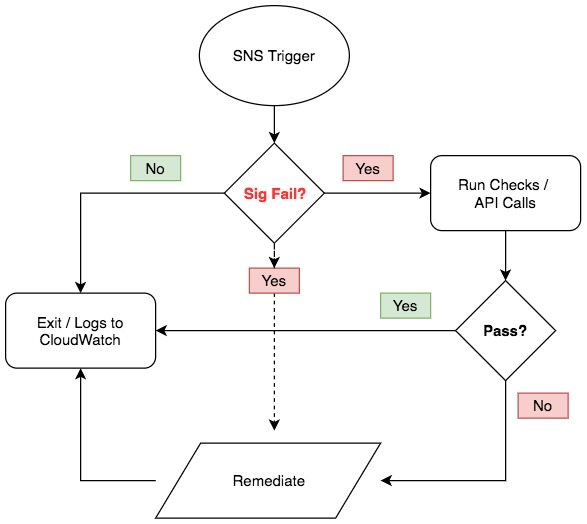

# Auto-Remediation via Lambda

A core design goal and philosophy at **Evident.io** is to provide our customers the most robust configuration security alerting platform on AWS and the remediation guidance to make those alerts actionable. Using our SNS integration, customers can extend that philosophy to make sure alerts are automatically remediated before you, or malicious actors, even know there’s an issue.

For more information including an Auto-Remediation walkthrough, please see [Evident Docs](http://docs.evident.io/#auto-remediation-via-lambda-walkthrough)

## Repo

Directory | Contents
--------- | ---------
lambda    | Auto-Remediation Lambda functions
policies  | IAM Role policies with the necessary permissions to run the corresponding Lambda function

## How it Works...

1. An ESP Signature via Amazon SNS integration triggers an alert and sends it to Lambda.
2. The Lambda auto-remediation function is launched and performs the following:
    1. Checks the ESP Signature status; Pass/Fail?
    2. If Fail; run checks to verify and remediate, log and exit.
3. In some cases it may make sense to bypass the checks and remediate immediately.  This accomplishes two things; 1) Faster Lambda function execution, and 2) Performs fewer AWS API calls.

For more information on ESP integrations, please see [Evident Docs](http://docs.evident.io/#integrations)
