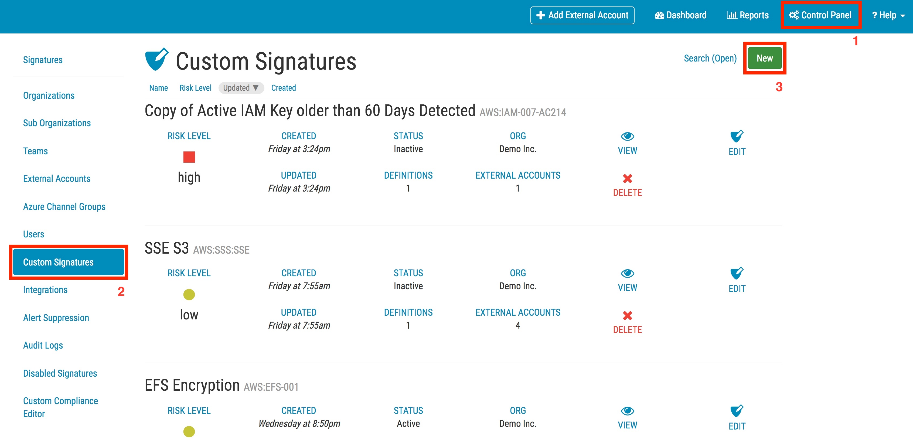
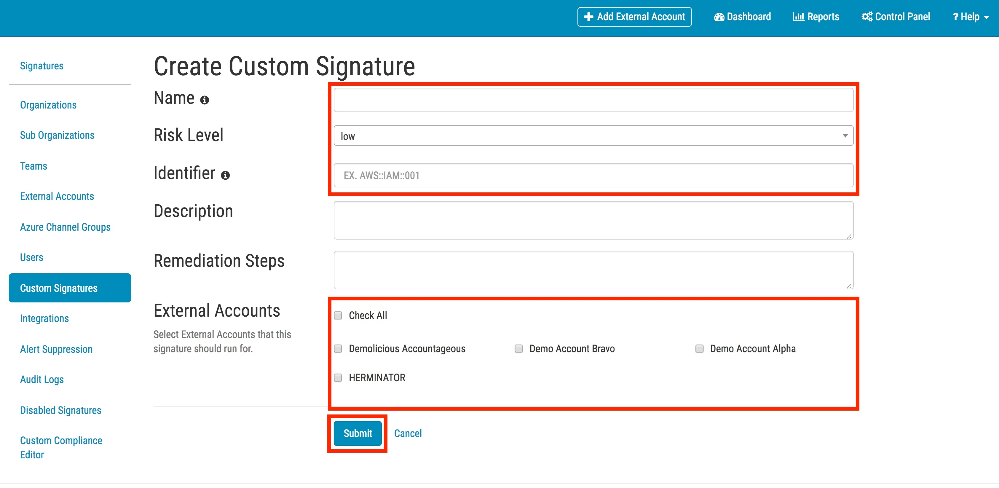
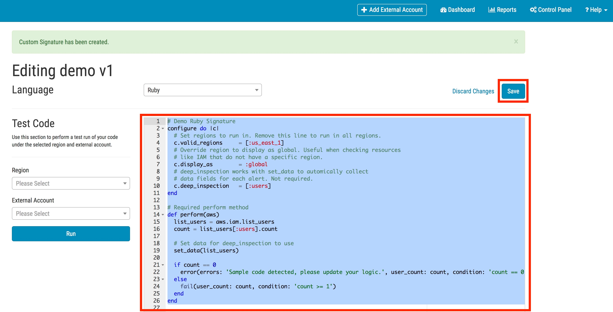
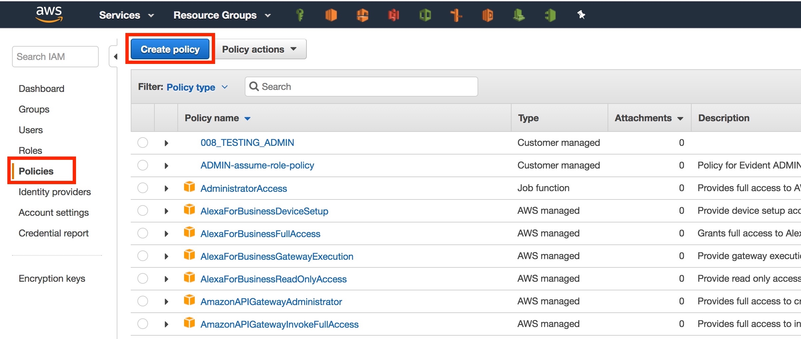
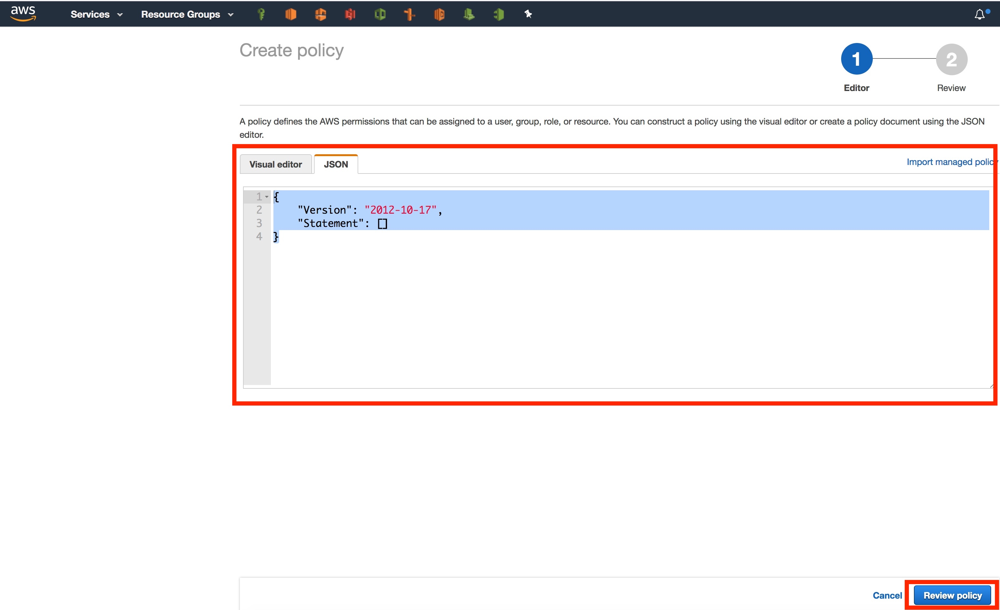
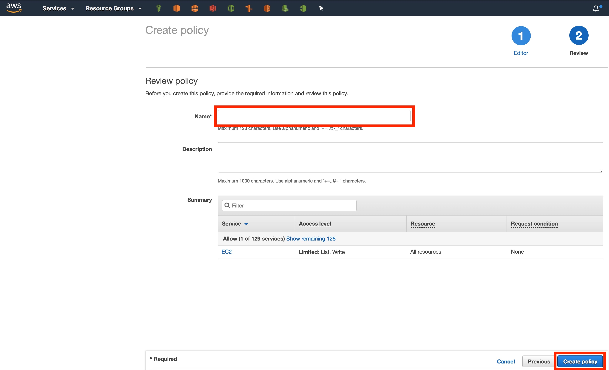
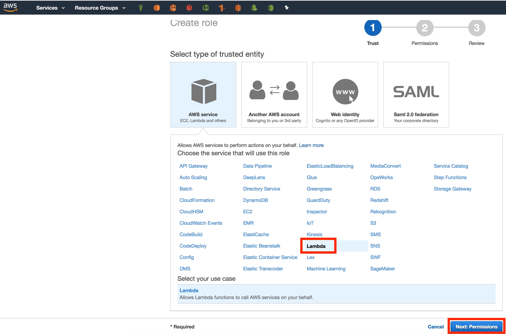
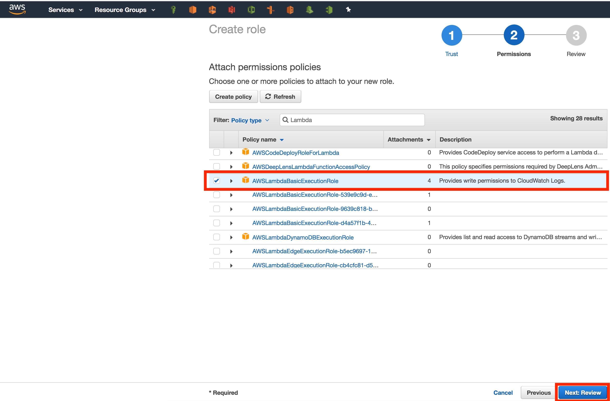
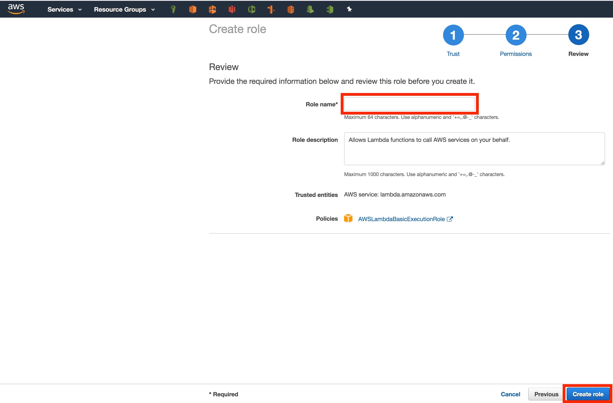

### Default VPC Auto-Remediate Walkthrough

This document walks through the steps to create an ESP custom signature, configure ESP SNS integration, and send alerts as events to Lambda for remediation.  The auto-remediation script used in this walkthrough attempts to delete the AWS default VPC from offending regions.

#### Create ESP Custom Signature

1. Login to ESP
2. On the top pane, select Control Panel, then Custom Signatures from the left-side column

3. Create a New signature
    * Name: **Remove Default VPC**
    * Risk Level: **Low**
    * Identifier: **AWS::VPC::099**
    * Description: "Attempts to delete the AWS default VPC from offending regions."
    * Select an External Account (or Accounts) and Submit

4. Copy & paste the code from the following link: [AWS_EC2 - default_vpc_check.rb](https://github.com/EvidentSecurity/custom_signatures/blob/master/AWS_EC2%20-%20default_vpc_check.rb)
5. Save your signature, but don't activate it just yet

---

#### ESP SNS Integration

1. Follow the instructions to setup ESP SNS Integration: [ESP SNS Integration](https://esp.evident.io/control_panel/integrations/amazon_sns/)
    * SNS Topic Name: **default-vpc-topic**
    * Team: Select the same team(s) as above in the Create Custom Signature step
    * Alert Types: **Fail** (Uncheck all others)
    * Signatures: Select **Amazon Low Risk Signatures** and choose the custom signature we just created; *Remove Default VPC*

---

#### Create IAM Policy and Role for Lambda

###### Lambda IAM Policy

1. From the AWS Console, IAM Dashboard, under Policies, select Create policy

2. In the Policy Document, select the JSON tab and copy & paste the policy from the following link: [AWS_EC2_default_vpc_policy.json](https://github.com/EvidentSecurity/automation/blob/master/autoremediate/aws/lambda/default_vpc_remediate/AWS_EC2_default_vpc_policy.json)
3. Select Review policy

4. Name the policy: **default-vpc-lambda**
5. Select Create policy

###### Lambda IAM Role

1. From the IAM Dashboard, under Roles, select Create role

2. Select the AWS Lambda role type, then Next: Permissions 

3. Attach **two** policies:
    * Check the policy we created above; *default-vpc-lambda*
    * Check the AWS managed policy; *AWSLambdaBasicExecutionRole*
4. Select Next: Review

5. Name the role: **default-vpc-lambda** and select Create role

---

#### Create Auto-Remediation Lambda Function

1. From the AWS Lambda Dashboard, select Create a Lambda function
2. Select the blueprint; *sns-message-python*
3. From the SNS topic drop-down menu, select the SNS topic we created in the integration step; *default-vpc-topic*
4. Check Enable trigger and select Next
5. Name the function and give it a description (if desired)
6. In the Lambda function code window, copy & paste the following auto-remediation script: [AWS_EC2_default_vpc_remediate.py](https://github.com/EvidentSecurity/automation/blob/master/autoremediate/aws/lambda/default_vpc_remediate/AWS_EC2_default_vpc_remediate.py)
7. Under the Existing role drop-down menu, choose the Lambda Role we created above; *default-vpc-lambda*
8. Toggle Advancing settings and enter the following:
    * Set the timeout value to 1 minute, 30 seconds
    * No VPC access is required
9. Select Next and Create function

---

#### Activate ESP Custom Signature

1. Login to ESP
2. On the top pane, select Control Panel, then Custom Signatures from the left-side column
3. Locate the *Remove Default VPC* signature, select View and Activate

---

#### Check CloudWatch Logs for Auto-Remediate Output

1. From the AWS CloudWatch Dashboard, select Logs in the left pane
2. Select the log group **/aws/lambda/<your_function_name>**
3. Check the log streams for output and/or errors

**Some Possible CloudWatch Log Messages**

* => VPC Results: vpc-6f8b720a in region eu-west-1 has been deleted.
    * The AWS default VPC was deleted successfully.

* => VPC Results: An error occurred (DependencyViolation) when calling the DeleteVpc operation: The vpc 'vpc-5e77c53b' has dependencies and cannot be deleted.
    * The AWS default VPC has dependencies.  Deleting the default VPC was unsuccessful. 
